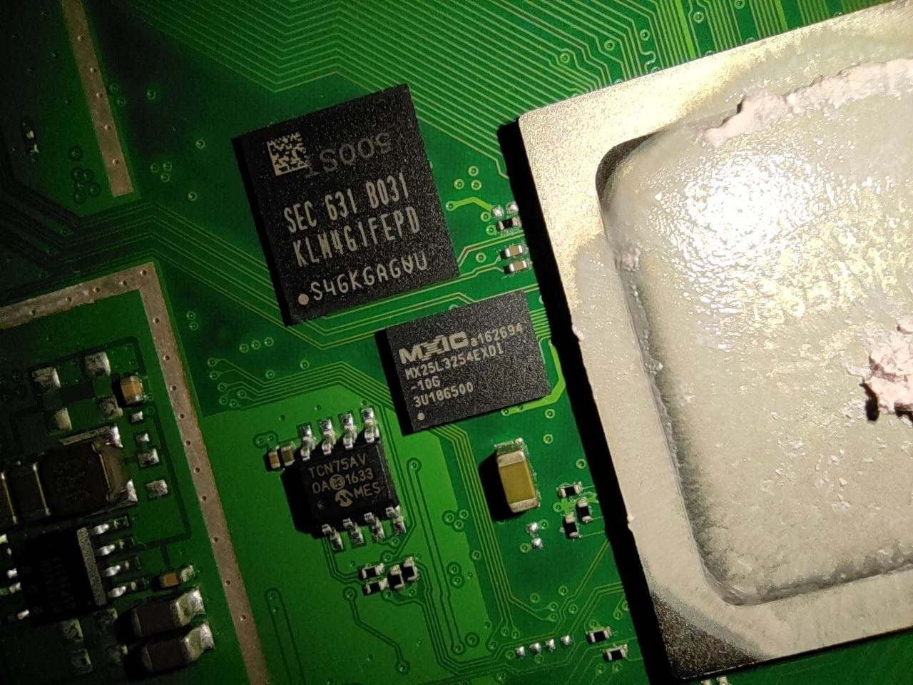
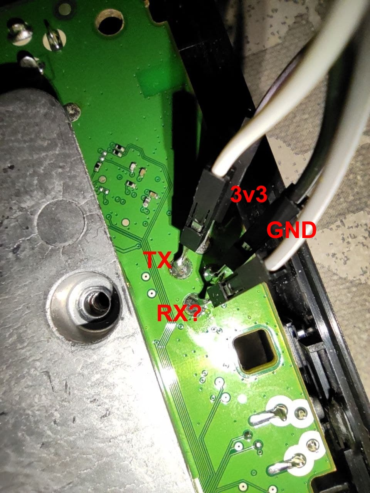

## Documents from reverse engineering the Sagemcom DTIW384 STB

This is a repo that tries to summarize various efforts in reverse engineering the Sagemcom DTIW384 STB.

This device is used by many EU ISPs as a DVB-T2 decoder with internet and paytv capabilities.

The device analyzed is the one sold by the french provider SFR called SFR STB7 Decoder Plus UHD.

#### Specs

The device has:
- 1 MicroSD slot
- 1 USB 3.0 Port
- 1 HDMI output
- 1 SPDIF output
- Reset button
- WPS button
- RJ45 Ethernet 10/100/1000
- WiFi Dual Band AC 3x3
- Bluetooth 4.0 (not sure about the version)

| Item | Name | Main features |
| --- | --- | --- |
| **SoC** | Broadcom BCM7252S | Dual-core ARM B15 |
| **eMMC** | Samsung KLM4G1FEPD | 4 GiB storage |
| **Flash** | Macronix MX25L3254EXDI-10G | 32 Mbit NOR Flash |
| **Decoder** | Sony CXD2837ER | DVB-T/T2 decoder |



#### Nmap results

Running nmap shows:
```
PORT      STATE  SERVICE
7000/tcp  closed afs3-fileserver
9080/tcp  open   glrpc
49152/tcp open   unknown
49153/tcp open   unknown
```

#### Test points

Test points were found on the bottom of the device and were accessible from the outside.
I was able to almost get the pinout (I'm not sure about the RX...).
Serial Boot dump is available in the *capture* folder.

